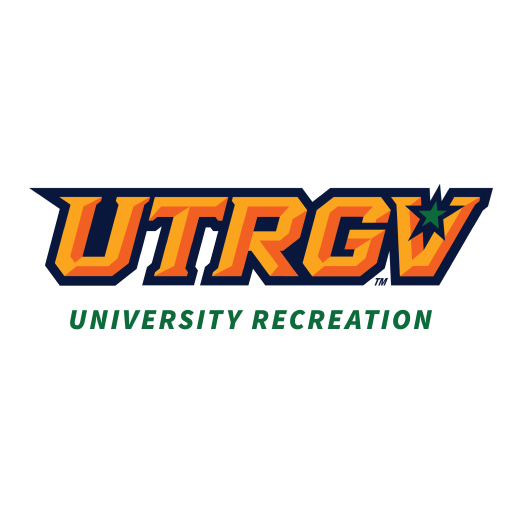

<!-- PROJECT LOGO -->
 

  

<h3 align="center">UTRGV Banner Upload</h3>

  

    Project Description: Automated Data Correction for University Recreation

Every semester, the University Recreation receives a list of around 20,000 active students to determine access eligibility. However, the list often contains incorrect information that needs to be set to default values for proper integration with the data upload program. Previously, this task required manually examining and correcting each entry, which was time-consuming and prone to human error.

To streamline this process, I developed a Python script that automates the identification and correction of erroneous data in the student list. The script efficiently scans the list, identifies incorrect data, and fixes it. It then outputs four CSV files with the corrected data. This automation significantly reduces the time required for data processing and ensures accuracy, eliminating the risk of human error.
    

<!-- ABOUT THE PROJECT -->
## About The Project

![HomeScreen-Screenshot][product-screenshot]

![Error-Message-Screenshot][Error-screenshot]

![Success-Message-Screenshot][Success-screenshot]

(<a href="#readme-top">back to top</a>)

### Built With

* Python
* Tkinter
* CustomTkinter
* Python CSV
* Python OS

(<a href="#readme-top">back to top</a>)

<!-- USAGE EXAMPLES -->
## Usage

This program was specifically designed to address the unique challenges faced by the University's Recreation department. It takes in to account the department's needs to accurately verify and manage a large list of active students, ensuring that only eligible individuals are granted access o the facilities. By automating the process of identifying and correcting errors in student data, the program effectively resolves the issues that previously required manual intervention and was susceptible to human error. 

(<a href="#readme-top">back to top</a>)

<!-- LICENSE -->
## License

Distributed under the MIT License. See `LICENSE.txt` for more information.

(<a href="#readme-top">back to top</a>)

<!-- CONTACT -->
## Contact

Email: JobeyFarias01@gmail.com

Linkedin: [https://www.linkedin.com/in/jobeyfarias/](https://www.linkedin.com/in/jobeyfarias/)

Project Link: [https://github.com/Jobeyy/UTRGV-Banner-Upload](https://github.com/Jobeyy/UTRGV-Banner-Upload)

(<a href="#readme-top">back to top</a>)

<!-- ACKNOWLEDGMENTS -->
## Acknowledgments
* **Significantly Reduced Processing Time**: The program automates the error correction process, cutting down the time required from hours or days to mere minutes.

* **Improved Accuracy**: By eliminating manual data entry, the program reduces the risk of human error, ensuring more reliable and accurate student data.
Increased Efficiency: The automated process allows staff to focus on other important tasks, improving overall efficiency within the University's Recreation department.

* **Enhanced Data Management**: The program outputs four organized CSV files with corrected data, facilitating better data management and easier integration with the existing systems.

* **Scalability**: The program can handle large datasets, making it scalable for future increases in student enrollment or additional data requirements.

* **User-Friendly**: The script is easy to run and requires minimal technical knowledge, making it accessible for staff members with varying levels of expertise.

* **Consistency**: Ensures that data corrections are applied consistently across the entire dataset, maintaining uniform standards for data integrity.

(<a href="#readme-top">back to top</a>)

<!-- MARKDOWN LINKS & IMAGES -->
[linkedin-url]: https://www.linkedin.com/in/jobeyfarias/
[product-screenshot]: imgs/homescreen.png
[Error-screenshot]: imgs/Error%20Image.png
[success-screenshot]: imgs/Success-image.png
[Python]: https://img.shields.io/badge/python-3670A0?style=for-the-badge&logo=python&logoColor=ffdd54
